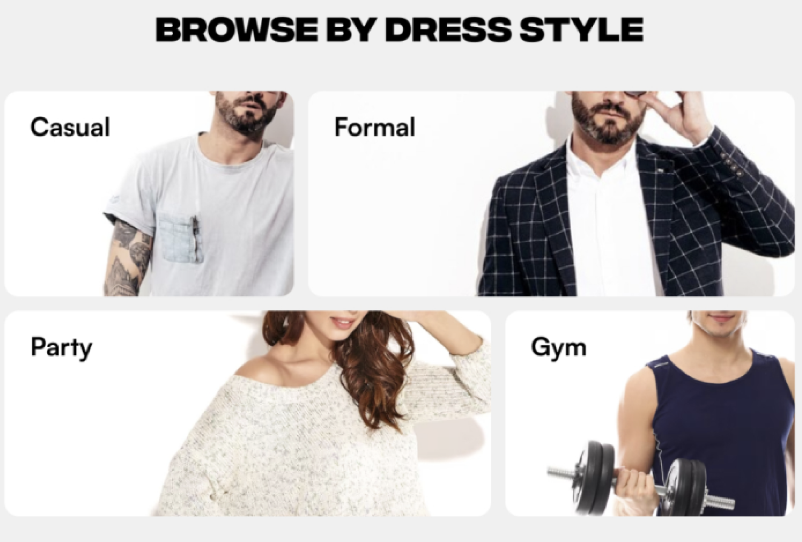
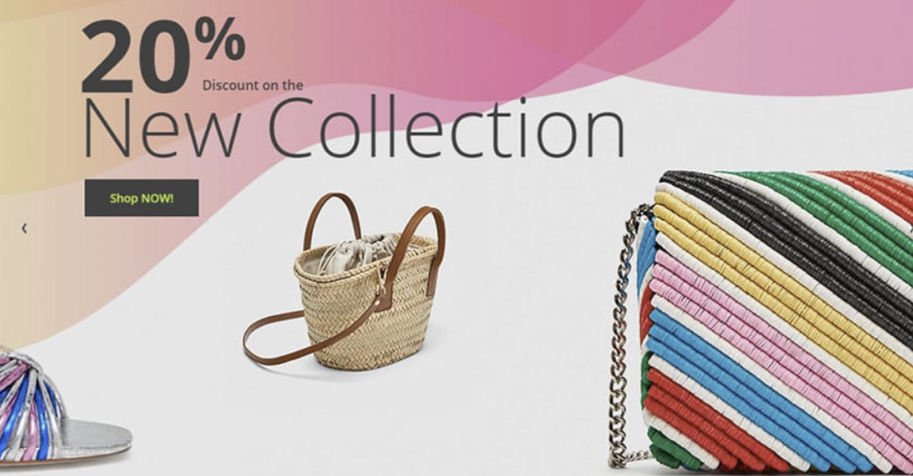
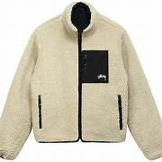

# Kristina
new file code explaining 

Index page:

<?php
include('includes/connect.php');
include('functions/common_function.php');

?>

This script ensures that:
	•	The database connection is established (from connect.php).

	•	Common functions are available (from common_function.php).

STYLE.CSS
/* General Styles */
body {
   font-family: Arial, sans-serif;
   margin: 0;
   padding: 0;
   text-align: center;
}

General PAGE STYLE

/* Scrollable Banner */
.scroll-container {
   width: 100vw;
   overflow: hidden;
   white-space: nowrap;
   background: #f8f9fa;
   padding: 15px 0;
}
.scroll-content {
   display: inline-block;
   white-space: nowrap;
   animation: scrollRight 15s linear infinite;
}
@keyframes scrollRight {
   from { transform: translateX(100%); }
   to { transform: translateX(-100%); }
}

Scrollable Banner STYLE 

/* Container Layouts */
.container {
   display: flex;
   justify-content: center;
   align-items: center;
   flex-wrap: wrap;
   gap: 50px;
   padding: 20px;
}

Container Layouts STYLE
/* Buttons */
.btn {
   padding: 8px 15px;
   border: 2px solid #ff9800;
   cursor: pointer;
   font-size: 14px;
   border-radius: 5px;
   background-color: white;
   color: #ff9800;
   transition: 0.3s;
}
.btn:hover {
   background-color: #ff9800;
   color: white;
}
 
Button OF PRODUCT STYLE

/* Testimonials Section */
.testimonials-container {
   text-align: center;
   background-color: rgba(232, 255, 226, 0.76);
   padding: 30px;
}
.reviews-container {
   display: flex;
   justify-content: center;
   flex-wrap: wrap;
   gap: 30px;
}
.review-card {
   width: 250px;
   padding: 20px;
   border-radius: 8px;
   background: white;
   box-shadow: 2px 2px 10px rgba(0, 0, 0, 0.1);
}

Testimonials Section STYLE 

/* Product Section */
.new-arrivals-container {
   display: flex;
   justify-content: center;
   flex-wrap: wrap;
   gap: 30px;
}
.product-card {
   width: 220px;
   border-radius: 8px;
   background-color: white;
   box-shadow: 2px 2px 10px rgba(0, 0, 0, 0.1);
   padding: 15px;
   text-align: center;
}
.product-card img {
   width: 100px;
   height: 100px;
   object-fit: cover;
}

Product Section STYLE

/* Categories Section */
.categories-container {
   display: flex;
   flex-wrap: wrap;
   justify-content: center;
   gap: 20px;
}
.category-box {
   background-color: #f5f5f5;
   padding: 20px 30px;
   font-size: 18px;
   text-transform: uppercase;
   border-radius: 6px;
   cursor: pointer;
   transition: 0.3s;
}
.category-box:hover {
   background-color: black;
   color: white;
   transform: scale(1.05);
}

Categories Section STYLE

/* Sidebar Layout */
.sidebar-fixed {
   min-height: 100vh;
   border-right: 2px solid #ddd;
   padding: 0;
}

Sidebar Layout STYLE

/* Responsive Design */
@media (max-width: 768px) {
   .profiles-container, .reviews-container, .categories-container {
       flex-direction: column;
       align-items: center;
   }
   .profile, .review-card, .product-card, .category-box {
       width: 90%;
   }
   .col-md-2 { display: none; }
}
@media (max-width: 480px) {
   .category-box { padding: 15px; }
   .btn { font-size: 12px; }
}

Responsive Design (Mobile View) STYLE

/* Oval Button Style */
.oval-button {
   display: flex;
   justify-content: center;
   align-items: center;
   width: 190px;
   height: 55px;
   border: 2px solid black;
   border-radius:140px;
   background-color: transparent;
   color: black;
   font-size: 16px;
   font-weight: bold;
   text-decoration: none;
   transition: 0.3s ease-in-out;
}

/* Hover Effect */
.oval-button:hover {
   background-color:rgb(0, 46, 96);
   color: white;
   transform: scale(1.1);
}

Oval Button STYLE

/* Hover Effect */
.oval-button:hover {
   background-color:rgb(0, 46, 96);
   color: white;
   transform: scale(1.1);
}

HOVER EFFECT FOR OVAL BUTTON 

.testimonials-container {
       text-align: center;
       background-color:  rgba(232, 255, 226, 0.76);
       padding: 30px;
       border-radius: 0px;
       color: black;
   }

.testimonials-title {
       font-size: 2em;
       font-weight: bold;
   }

   .testimonials-subtitle {
       font-size: 1.2em;
   }

.reviews-container {
       display: flex;
       justify-content: center;
       gap: 50px;
       flex-wrap: wrap;
       margin-top: 20px;
   }

Testimonials Section STYLE 
.review-card {
       width: 290px;
       height: 350px;

       padding: 35px;
       border: 1px solid #ddd;
       border-radius: 8px;
       text-align: center;
       box-shadow: 2px 2px 10px rgba(0, 0, 0, 0.1);
       background: white;
       color: black;
   }

   .image {
       width: 80px;
       height: 80px;
       background-size: cover;
       background-position: center;
       border-radius: 50%;
       margin: 0 auto 10px;
   }

   .name {
       font-size: 1.2em;
       margin-bottom: 5px;
   }

   .comment {
       font-style: italic;
       margin-bottom: 10px;
   }

   .rating {
       font-size: 1.5em;
   }

Review Cards STYLE
.service-card .icon img {
         position: flex;
         justify-content: center;
         align-items: center;
   width: 50%;
   height: auto;
   max-width: 100px;
   margin-bottom: 5px;
}

.container{
   display: flex;
   justify-content: center;
   align-items: center;
   gap: 80px;
}

div.icon{
 display: flex;
   justify-content: center;
   align-items: center;
}

Service Card STYLE
.form-row {

gap: 5px;

   justify-content: center;
   align-items: center;
   text: center;
}

STYLE form rows
/* footer */
.buttonforfooter {
   display: flex;
   justify-content: center;
   margin-top: 10px;
}

.btn-footer {
   width: 500px;
   height: 45px;
   display: flex;
   align-items: center;
   justify-content: center;
   font-size: 20px;
   background-color: white;
   color: #ff9800;
   border: 2px solid #ff9800;
   border-radius: 8px;
   font-weight: bold;
   cursor: pointer;
   transition: all 0.3s ease;
   text-transform: uppercase;
}

.btn-footer:hover {
   background-color: #ff9800;
   color: white;
}

Footer Section STYLE
@media (max-width: 768px) {
   .footer .row {
       flex-direction: column;
       text-align: center;
   }

   .footer .form-row {
       flex-direction: column;
   }

   /* Responsive Subscribe Button */
   .btn-footer {
       width: 100%;
       max-width: 300px;
       height: 50px;
       font-size: 18px;
   }
}
 
Responsiveness 
<!DOCTYPE html>
<html lang="en">
<head>
   <meta charset="UTF-8">
   <meta name="viewport" content="width=device-width, initial-scale=1.0">
   <title>HOME</title>

HTML Metadata & Title
<!-- bootstrap CSS link -->
    <link rel="stylesheet" href="https://cdn.jsdelivr.net/npm/bootstrap@5.3.3/dist/css/bootstrap.min.css">

Bootstrap CSS for Styling
<!-- font awesome link -->
   <link rel="stylesheet" href="https://cdnjs.cloudflare.com/ajax/libs/font-awesome/6.0.0/css/all.min.css">

Font Awesome for Icons
 <!-- css link -->
    <link rel="stylesheet" href="style.css">

CSS link
<!-- Owl Carousel CSS -->
   <link rel="stylesheet" href="https://cdnjs.cloudflare.com/ajax/libs/OwlCarousel2/2.3.4/assets/owl.carousel.min.css">
   <link rel="stylesheet" href="https://cdnjs.cloudflare.com/ajax/libs/OwlCarousel2/2.3.4/assets/owl.theme.default.min.css">

Owl Carousel CSS
<!-- Include Owl Carousel CSS -->
<link rel="stylesheet" href="https://cdnjs.cloudflare.com/ajax/libs/OwlCarousel2/2.3.4/assets/owl.carousel.min.css">
<link rel="stylesheet" href="https://cdnjs.cloudflare.com/ajax/libs/OwlCarousel2/2.3.4/assets/owl.theme.default.min.css">

<!-- Include jQuery and Owl Carousel JS -->

<!-- Initialize Owl Carousel -->

Owl Carousel Working code

<!-- navbar -->

Navbar Container
 <nav class="navbar navbar-expand-lg bg-pink
   ">

Navbar Component
 

   

Navbar Content
<button class="navbar-toggler" type="button" data-bs-toggle="collapse" data-bs-target="#navbarSupportedContent" aria-controls="navbarSupportedContent" aria-expanded="false" aria-label="Toggle navigation">
     
  </button>

Responsive Navbar Toggle Button

     <ul class="navbar-nav me-auto mb-2 mb-lg-0">

Collapsible Menu (Links Section)
<li class="nav-item">
         <a class="nav-link active" aria-current="page" href="./index2.php">Home</a>
       </li>

 <li class="nav-item">
         <a class="nav-link" href="./registration.php">Register</a>
       </li>

       <li class="nav-item">
         <a class="nav-link" href="./aboutus.php">About Us</a>
       </li>
      

Navigation Links
<li class="nav-item">
         <a class="nav-link" href="#"> <i class="fa-solid fa-cart-shopping"></i></i>1</a>
       </li>

Shopping Cart Icon
 <li class="nav-flex">
         <a class="nav-link" href="#">Total Price:100/-</a>
       </li>
     </ul>

Total Price Display
  <form class="d-flex" role="search">
       <input class="form-control me-2" type="search" placeholder="Search" aria-label="Search">
       <button class="btn btn-outline-success" type="submit">Search</button>
     </form>
   

 

</nav>

Search Bar

<nav class="navbar navbar-expand-lg navbar-dark bg-white">

Second Child - Additional Navbar
<ul class="navbar-nav me-auto">

Navigation Links
   <li class="nav-item">
       <a class="nav-link text-black" href="./registration.php">Welcome Guest</a>
       </li>
       <li class="nav-item">
         <a class="nav-link text-black" href="./registration.php">Login</a>
       </li>
</ul>
</nav>

Guest & Registration Links

<!-- thirt child -->
 

Third Child - Store Information
<h3 class="text-center">MY STORE</h3>

Store Title

Comunication is at the heart of e-commerce and community

 

Store Slogan
<!-- baners own carusel  -->
<section id="banner-area">

Section: Banner Area

 Owl Carousel Setup

               
           

         

               
           

           

               
           

       

   </section>

<!-- baners own carusel end  -->

Banner Items (Slides)

  <!-- jQuery -->
  

  <!-- Owl Carousel JS -->
  

  

Example Script (Add at the Bottom of index.php or a JS file)

   

Main Layout (Bootstrap Grid)

Sidebar (Categories & Brands)
 <!-- Brands Section -->
           <ul class="navbar-nav text-center">
               <li class="nav-item bg-dark p-2">
                   <a href="#" class="nav-link text-white"><h4>Delivery Brands</h4></a>
               </li>
               <?php getbrands(); ?> <!-- Fetch brands -->
           </ul>

Brands Section
	•	Creates a Bootstrap-styled list (<ul>) for brands.

	•	The first <li> item → Contains a title ("Delivery Brands").

	•	getbrands(); → This is a PHP function that fetches brand names from a database.

How getbrands(); Works (PHP)
	•	This function is likely inside a separate PHP file (e.g., functions.php).

	•	It queries a database for brand names and dynamically inserts them here.

Example PHP function:

 php
CopyEdit
function getbrands() {
    global $conn; // Database connection
    $query = "SELECT * FROM brands";
    $result = mysqli_query($conn, $query);
    while ($row = mysqli_fetch_assoc($result)) {
        echo "<li class='nav-item'><a class='nav-link' href='index.php?brand={$row['brand_id']}'>{$row['brand_name']}</a></li>";
    }
}
This would generate HTML like:
html
CopyEdit
<li class='nav-item'><a class='nav-link' href='index.php?brand=1'>Nike</a></li>
<li class='nav-item'><a class='nav-link' href='index.php?brand=2'>Adidas</a></li>

<!-- Categories Section -->
           <ul class="navbar-nav text-center mt-3">
               <li class="nav-item bg-dark p-2">
                   <a href="#" class="nav-link text-white"><h4>Categories</h4></a>
               </li>
               <?php getcategories(); ?> <!-- Fetch categories -->
           </ul>
       

Categories Section

Similar to the brands section.

getcategories(); is a PHP function that retrieves product categories from a database.

Example PHP function:

function getcategories() {
    global $conn;
    $query = "SELECT * FROM categories";
    $result = mysqli_query($conn, $query);
    while ($row = mysqli_fetch_assoc($result)) {
        echo "<li class='nav-item'><a class='nav-link' href='index.php?category={$row['category_id']}'>{$row['category_name']}</a></li>";
    }
}

 <!-- Right Product Section -->
       

           

               <?php getproducts(); ?> <!-- Fetch products -->
           

       

Product Display Section

	•	col-md-10 → This takes up 10 out of 12 columns (main content area).

	•	row justify-content-center → Bootstrap classes for:

	•	row → Organizes products in rows.

	•	justify-content-center → Centers the product items.

	•	getproducts(); → A PHP function that fetches products dynamically.

How getproducts(); Works (PHP)
function:

 php
CopyEdit
function getproducts() {
    global $conn;
    $query = "SELECT * FROM products ORDER BY RAND() LIMIT 12";
    $result = mysqli_query($conn, $query);
    while ($row = mysqli_fetch_assoc($result)) {
        echo "
        

            

                
                

                    <h5 class='card-title'>{$row['product_name']}</h5>
                    
Price: £{$row['product_price']}

                    <a href='product.php?id={$row['product_id']}' class='btn btn-primary'>View Product</a>
                

            

        
";
    }
}

<!-- Categories Section -->
<section id="categories">
 
Section Wrapper
<h2 class="categories_style">BROWSE BY CATEGORY</h2>

Section Title
  
   

Categories Container
  
Women Arrivals

       
Men Arrivals

       
Kids Arrivals

       
Junior Arrivals

       
Sport Wearing

       
Home Outfit

Category Boxes

In the same way top-selling section 

       <h2 class="new-arrivals-title">NEW ARRIVALS</h2>

Section Container new-arrivals section
 

Product Grid Container

               
               <h5 class="card-title">River Island Blazer</h5>
               
⭐⭐⭐⭐☆

               
£152

               
New Blazer, designed for those who appreciate timeless style...

               <a href="#" class="btn my-2">View More</a>
              
           

           

               
               <h5 class="card-title">Louis Vuitton Handbag</h5>
               
⭐⭐⭐⭐⭐

               
£152

               
Louis Vuitton handbag, handbag showcases....

               <a href="#" class="btn my-2">View More</a>
              
           

           

               
               <h5 class="card-title">River Island Cardigan</h5>
               
⭐⭐☆☆☆

               
£152

               
New Cardigan Collection, designed to keep... 

               <a href="#" class="btn my-2">View More</a>
              
           

           

               
               <h5 class="card-title">River Island Trench</h5>
               
⭐⭐⭐☆☆

               
£152

               
New Trench Coat, a perfect blend of classic design and modern....

               <a href="#" class="btn my-2">View More</a>
              
           

           

               
               <h5 class="card-title">UNIQLO Jeans</h5>
               
⭐⭐☆☆☆

               
£152

               
New Dark Jeans, designed for those who appreciate timeless style...

               <a href="#" class="btn my-2">View More</a>
              
           

           

               
               <h5 class="card-title">River Island Trench</h5>
               
⭐⭐⭐⭐☆

               
£152

               
River Island Trench Coat, a timeless wardrobe staple designed......

               <a href="#" class="btn my-2">View More</a>
              
           

           

               
               <h5 class="card-title">River Island Blazer new</h5>
               
⭐⭐⭐⭐☆

               
£152

               
River Island Blazer, a perfect mix of classic......

               <a href="#" class="btn my-2">View More</a>
              
           

           

               
               <h5 class="card-title">River Island blazer</h5>
               
⭐⭐☆☆☆

               
£152

               
River Island Blazer, designed for a perfect blend of sophistication...

               <a href="#" class="btn my-2">View More</a>
              
           

           

               
               <h5 class="card-title">UNIQLO Jacket</h5>
               
⭐⭐☆☆☆

               
£152

               
UNIQLO Jacket, designed for ultimate comfort and versatility.........

               <a href="#" class="btn my-2">View More</a>
              
           

           

               
               <h5 class="card-title">Louis Vuitton Handbag</h5>
               
⭐⭐☆☆☆

               
£600

               
Louis Vuitton Handbag, a perfect blend of iconic... 

               <a href="#" class="btn my-2">View More</a>
              
           

           

               
               <h5 class="card-title">Vogue Sunglases</h5>
               
⭐⭐☆☆☆

               
£152

               
Vogue Sunglasses, designed for fashion-forward individuals... 

               <a href="#" class="btn my-2">View More</a>
              

           

               
               <h5 class="card-title">PRADA BELT</h5>
               
⭐⭐☆☆☆

               
£80.99

               
Prada Logo Leather Belt, a statement of sophistication and.... 

               <a href="./viewmore.php" class="btn my-2">View More</a>
              
           

       

   

     

Product Card Structure
   

   <a href="#" class="oval-button ">All Arrivals</a>

  

"All Arrivals" Button Section

   <h1 class="testimonials-title">Testimonials</h1>
   
"Quotes from our happy customers"

Testimonials Section
 

Customer Reviews

           

           <h2 class="name">John Doe</h2>
           
"Absolutely loved this product! High quality and great service."

           
⭐️⭐️⭐️⭐️☆

       

       

           

           <h2 class="name">Sarah Johnson</h2>
           
"Good value for the price. Will definitely buy again! Absolutely loved this product!"

           
⭐️⭐️⭐️⭐️⭐️

       

       

           

           <h2 class="name">Mike Williams</h2>
           
"Decent product, but delivery took longer than expected. Absolutely loved this product!"

           
⭐️⭐️⭐️☆☆

       

   

      
 
Example cards with reviews 

Container Wrapper

       

           
       

       <h3>FREE AND FAST DELIVERY</h3>
       
Free delivery for all orders over £140

   

FREE AND FAST DELIVERY
Individual Service Cards
 

       

           
       

       <h3>24/7 CUSTOMER SERVICE</h3>
       
Friendly 24/7 customer support

   

24/7 CUSTOMER SERVICE

       

           
       

       <h3>MONEY BACK GUARANTEE</h3>
       
We return money within 30 days

   

MONEY BACK GUARANTEE

<footer id="footer" class="bg-dark text-white py-5">

Footer Container

               <h4 class="font-rubik font-size-20">MY STORE</h4>
               
Lorem ipsum dolor sit amet consectetur, adipisicing elit. Repellendus, deserunt.

             

Store Description

               <h4 class="font-rubik font-size-20">Newslatter</h4>
               <form class="form-row">
                 

                   <input type="text" class="form-control" placeholder="Email *">
                 

                 

                   <button type="submit" class="btn btn-footer mb-2">Subscribe</button>
                 

               </form>
             

Newsletter Subscription Form

               <h4 class="font-rubik font-size-20">Information</h4>
               

                 <a href="./aboutus.php" class="font-rale font-size-14 text-white-50 pb-1">About Us</a>
                 <a href="#" class="font-rale font-size-14 text-white-50 pb-1">Delivery Information</a>
                 <a href="#" class="font-rale font-size-14 text-white-50 pb-1">Privacy Policy</a>
                 <a href="#" class="font-rale font-size-14 text-white-50 pb-1">Terms & Conditions</a>
               

             

Information Links (About Us, Privacy Policy, etc.)

               <h4 class="font-rubik font-size-20">Account</h4>
               

                 <a href="./registration.php" class="font-rale font-size-14 text-white-50 pb-1">My Account</a>
                 <a href="#" class="font-rale font-size-14 text-white-50 pb-1">Order History</a>
                 <a href="#" class="font-rale font-size-14 text-white-50 pb-1">Wish List</a>
                 <a href="./aboutus.php" class="font-rale font-size-14 text-white-50 pb-1">Newslatters</a>
               

User Account Links (My Account, Order History, etc.)

About us page:

<!DOCTYPE html>
<html lang="en">
<head>
   <meta charset="UTF-8">
   <meta name="viewport" content="width=device-width, initial-scale=1.0">
   <title>HOME</title>

HTML Metadata & Title
<!-- bootstrap CSS link -->
    <link rel="stylesheet" href="https://cdn.jsdelivr.net/npm/bootstrap@5.3.3/dist/css/bootstrap.min.css">

Bootstrap CSS for Styling
<!-- font awesome link -->
   <link rel="stylesheet" href="https://cdnjs.cloudflare.com/ajax/libs/font-awesome/6.0.0/css/all.min.css">

Font Awesome for Icons
 <!-- css link -->
    <link rel="stylesheet" href="style.css">

CSS link
<!-- Owl Carousel CSS -->
   <link rel="stylesheet" href="https://cdnjs.cloudflare.com/ajax/libs/OwlCarousel2/2.3.4/assets/owl.carousel.min.css">
   <link rel="stylesheet" href="https://cdnjs.cloudflare.com/ajax/libs/OwlCarousel2/2.3.4/assets/owl.theme.default.min.css">

body {
   font-family: Arial, sans-serif;
   margin: 0;
   padding: 0;
   text-align: center;
}

General Style
/* Scrollable Banner */
.scroll-container {
   width: 100vw;
   overflow: hidden;
   white-space: nowrap;
   background: #f8f9fa;
   padding: 15px 0;
}
.scroll-content {
   display: inline-block;
   white-space: nowrap;
   animation: scrollRight 15s linear infinite;
}

Scrollable Banner

/* Container Layouts */
.container {
   display: flex;
   justify-content: center;
   align-items: center;
   flex-wrap: wrap;
   gap: 50px;
   padding: 20px;
}

Container Layouts
/* Buttons */
.btn {
   padding: 8px 15px;
   border: 2px solid #ff9800;
   cursor: pointer;
   font-size: 14px;
   border-radius: 5px;
   background-color: white;
   color: #ff9800;
   transition: 0.3s;
}
.btn:hover {
   background-color: #ff9800;
   color: white;
}

Button Styling
/* profile pages */
.profiles-container {
 display: flex;
 flex-wrap: wrap;
 gap: 20px;
 justify-content: center;
 padding: 20px;
}

/* Individual Profile Card */
.profile {
 width: 370px;
 height: auto;
 background-color: #fff;
 border-radius: 4px;
 display: flex;
 flex-direction: column;
 align-items: center;
 padding: 16px;
 box-sizing: border-box;
 position: relative;
}

Profile Page Styling
/* Image Styling */
.image {
 width: 236px;
 height: 391px;
 background-size: cover;
 background-position: center;
 border-radius: 4px;
 margin-bottom: 16px;
}

.info {
 text-align: center;
 display: flex;
 flex-direction: column;
 align-items: center;
}

Profile Image
.name {
 font-family: 'Inter', sans-serif;
 font-weight: 500;
 font-size: 32px;
 color: #000;
 margin: 0;
}

.title {
 font-size: 16px;
 color: #000;
 margin-top: 8px;
}

Profile Name & Title
/* Social Media Icons */
.social-media {
 display: flex;
 gap: 10px;
 margin-top: 16px;
}

.social-icon {
 width: 24px;
 height: 24px;
 border-radius: 50%;
 background-color: #000;
}

.social-icon.twitter {
 background-image: url('twitter-icon.png');
 background-size: contain;
 background-repeat: no-repeat;
}

.social-icon.instagram {
 background-image: url('instagram-icon.png');
 background-size: contain;
 background-repeat: no-repeat;
}

.social-icon.linkedin {
 background-image: url('linkedin-icon.png');
 background-size: contain;
 background-repeat: no-repeat;
}

Social Media Icons

* Responsivenes */
@media (max-width: 768px) {
   .profiles-container {
       flex-direction: column;
       align-items: center;
       gap: 15px;
   }

   .profile {
       width: 90%;
       max-width: 350px;
       padding: 12px;
   }

   .image {
       width: 90%;
       max-width: 220px;
       height: auto;
   }

   .name {
       font-size: 28px;
   }

   .title {
       font-size: 14px;
   }

   .social-media {
       gap: 8px;
   }

   .social-icon {
       width: 22px;
       height: 22px;
   }
}

Responsiveness

/* footer btn */
.buttonforfooter {
   display: flex;
   justify-content: center;
   margin-top: 10px;
}

Footer Button & Form

/* Subscribe Button */
.btn-footer {
   width: 500px;
   height: 45px;
   display: flex;
   align-items: center;
   justify-content: center;
   font-size: 20px;
   background-color: white;
   color: #ff9800;
   border: 2px solid #ff9800;
   border-radius: 8px;
   font-weight: bold;
   cursor: pointer;
   transition: all 0.3s ease;
   text-transform: uppercase;
}

/* Hover Effect */
.btn-footer:hover {
   background-color: #ff9800;
   color: white;
}

Subscribe Button

/* Responsive Footer */
@media (max-width: 768px) {
   .footer .row {
       flex-direction: column;
       text-align: center;
   }

   .footer .form-row {
       flex-direction: column;
   }

   .btn-footer {
       width: 100%;
       max-width: 300px;
       height: 50px;
       font-size: 18px;
   }
}

Footer Responsive Design
/* service card */
   
.service-card .icon img {
         position: flex;
         justify-content: center;
         align-items: center;
   width: 50%;
   height: auto;
   max-width: 100px;
   margin-bottom: 5px;
}

.container{
   display: flex;
   justify-content: center;
   align-items: center;
   gap: 80px;
}

div.icon{
 display: flex;
   justify-content: center;
   align-items: center;
}

.form-row {

gap: 5px; /* Adjust spacing between input and button */

   justify-content: center;
   align-items: center;
   text: center;
}
/* service card end*/

Service cards end

<!-- navbar -->

   <!-- first child -->
   <nav class="navbar navbar-expand-lg bg-pink
   ">
 

   
   <button class="navbar-toggler" type="button" data-bs-toggle="collapse" data-bs-target="#navbarSupportedContent" aria-controls="navbarSupportedContent" aria-expanded="false" aria-label="Toggle navigation">
     
   </button>
   

     <ul class="navbar-nav me-auto mb-2 mb-lg-0">
       <li class="nav-item">
         <a class="nav-link active" aria-current="page" href="./index2.php">Home</a>
       </li>
       <li class="nav-item">
         <a class="nav-link" href="./registration.php">Register</a>
       </li>

       <li class="nav-item">
         <a class="nav-link" href="./aboutus.php">About Us</a>
       </li>
      
       <li class="nav-item">
         <a class="nav-link" href="#"> <i class="fa-solid fa-cart-shopping"></i></i>1</a>
       </li>

       <li class="nav-flex">
         <a class="nav-link" href="#">Total Price:100/-</a>
       </li>
     </ul>

     <form class="d-flex" role="search">
       <input class="form-control me-2" type="search" placeholder="Search" aria-label="Search">
       <button class="btn btn-outline-success" type="submit">Search</button>
     </form>
   

 

</nav>

Navbar section 

<!-- second child -->
<nav class="navbar navbar-expand-lg navbar-dark bg-white">
<ul class="navbar-nav me-auto">
       <li class="nav-item">
       <a class="nav-link text-black" href="./registration.php">Welcome Guest</a>
       </li>
       <li class="nav-item">
         <a class="nav-link text-black" href="./registration.php">Login</a>
       </li>

</ul>
</nav>

Guest & Registration Links

Main Container

<h2>About Us</h2>

Section title

Welcome to My Store, your go-to destination for a seamless and enriching shopping experience! We are an innovative e-commerce platform dedicated to making online shopping easy, enjoyable, and accessible for customers while helping businesses grow in the digital world.

 

Introduction pharagraph

<strong>For Our Customers we offer:</strong>

Customer befinds section

<strong>Diverse Products</strong>

From fashion and electronics to everyday essentials and unique handmade goods.

<strong>Seamless Shopping</strong>

An intuitive, user-friendly platform with easy browsing and secure payments.

<strong>Reliable Shipping</strong>

Fast delivery with tracking options.

<strong>Dedicated Support</strong>

Our customer service team is always ready to help.

   

<strong>For Our Businesses</strong>
<strong>We provide tools to help businesses succeed, including:</strong>
  
<strong>Easy Product Management </strong>

Quick product listing and inventory tracking.

<strong>Customer & Order Management</strong>

Streamlined processes for better customer relationships.

<strong>Marketing & Insights</strong>

Promotions, analytics, and targeted advertising.

<strong>Dedicated Business Support</strong>

Helping businesses thrive in the online marketplace.

   

<strong>Our Vision & Values</strong>

We strive to build a dynamic, sustainable shopping ecosystem based on integrity, innovation, customer focus, collaboration, and sustainability.

 
<strong>Join Us Today!</strong>

Discover great deals or grow your business with My Store. We’re here to make shopping and selling better for everyone.

     
<strong>Thank you for choosing My Store—we look forward to serving you!</strong>
  
   

Key Features for Business

 

       <h2 class="new-arrivals-title">Created by</h2>

Main Section Wrapper

Profiles container

<!-- Profile 1 -->
   

     

     

       <h2 class="name">Tom Cruise</h2>
       
Founder & Chairman

       

       <i class="fa-brands fa-twitter"></i>
       <i class="fa-brands fa-instagram"></i>
       <i class="fa-brands fa-facebook"></i>
       

     

   

   <!-- Profile 2 -->
   

     

     

       <h2 class="name">Emma Watson</h2>
       
Managing Director

       

       <i class="fa-brands fa-twitter"></i>
       <i class="fa-brands fa-instagram"></i>
       <i class="fa-brands fa-facebook"></i>
       

     

   

   <!-- Profile 3 -->
   

     

     

       <h2 class="name">Will Smith</h2>
       
Product Designer

       

       <i class="fa-brands fa-twitter"></i>
       <i class="fa-brands fa-instagram"></i>
       <i class="fa-brands fa-facebook"></i>
       

     

   

 

      

Profile cards

Container Wrapper

       

           
       

       <h3>FREE AND FAST DELIVERY</h3>
       
Free delivery for all orders over £140

   

FREE AND FAST DELIVERY
Individual Service Cards
 

       

           
       

       <h3>24/7 CUSTOMER SERVICE</h3>
       
Friendly 24/7 customer support

   

24/7 CUSTOMER SERVICE

       

           
       

       <h3>MONEY BACK GUARANTEE</h3>
       
We return money within 30 days

   

MONEY BACK GUARANTEE

<footer id="footer" class="bg-dark text-white py-5">

Footer Container

               <h4 class="font-rubik font-size-20">MY STORE</h4>
               
Lorem ipsum dolor sit amet consectetur, adipisicing elit. Repellendus, deserunt.

             

Store Description

               <h4 class="font-rubik font-size-20">Newslatter</h4>
               <form class="form-row">
                 

                   <input type="text" class="form-control" placeholder="Email *">
                 

                 

                   <button type="submit" class="btn btn-footer mb-2">Subscribe</button>
                 

               </form>
             

Newsletter Subscription Form

               <h4 class="font-rubik font-size-20">Information</h4>
               

                 <a href="./aboutus.php" class="font-rale font-size-14 text-white-50 pb-1">About Us</a>
                 <a href="#" class="font-rale font-size-14 text-white-50 pb-1">Delivery Information</a>
                 <a href="#" class="font-rale font-size-14 text-white-50 pb-1">Privacy Policy</a>
                 <a href="#" class="font-rale font-size-14 text-white-50 pb-1">Terms & Conditions</a>
               

             

Information Links (About Us, Privacy Policy, etc.)

               <h4 class="font-rubik font-size-20">Account</h4>
               

                 <a href="./registration.php" class="font-rale font-size-14 text-white-50 pb-1">My Account</a>
                 <a href="#" class="font-rale font-size-14 text-white-50 pb-1">Order History</a>
                 <a href="#" class="font-rale font-size-14 text-white-50 pb-1">Wish List</a>
                 <a href="./aboutus.php" class="font-rale font-size-14 text-white-50 pb-1">Newslatters</a>
               

User Account Links (My Account, Order History, etc.)

Registration Page:

<!DOCTYPE html>
<html lang="en">

<head>
   <meta charset="UTF-8">
   <meta name="viewport" content="width=device-width, initial-scale=1.0">
   <title>Register</title>
   <link rel="stylesheet" href="styles.css">
</head>

Basic HTML Structure

Style in page 

Responsive Design

       

           
       

       

           <h2>Log in to Exclusive</h2>
           <form action="#" method="POST">
               <input type="email" name="email" placeholder="Email" required>
               <input type="password" name="password" placeholder="Password" required>
               

                   <button type="submit" class="login-btn">Log In</button>
                   
<a href="#">Forgot Password?</a>

               

           </form>
       

   

Form Submission Functionality

Product page introduction:

<!DOCTYPE html>
<html lang="en">
<head>
   <meta charset="UTF-8">
   <meta name="viewport" content="width=device-width, initial-scale=1.0">
   <title>HOME</title>

HTML Metadata & Title
<!-- bootstrap CSS link -->
    <link rel="stylesheet" href="https://cdn.jsdelivr.net/npm/bootstrap@5.3.3/dist/css/bootstrap.min.css">

Bootstrap CSS for Styling
<!-- font awesome link -->
   <link rel="stylesheet" href="https://cdnjs.cloudflare.com/ajax/libs/font-awesome/6.0.0/css/all.min.css">

Font Awesome for Icons
 <!-- css link -->
    <link rel="stylesheet" href="style.css">

CSS link

body {
   font-family: Arial, sans-serif;
   margin: 0;
   padding: 0;
   text-align: center;
}

General Styles

.scroll-container {
   width: 100vw;
   overflow: hidden;
   white-space: nowrap;
   background: #f8f9fa;
   padding: 15px 0;
}
.scroll-content {
   display: inline-block;
   white-space: nowrap;
   animation: scrollRight 15s linear infinite;
}

Scrollable Banner

.container {
   display: flex;
   justify-content: center;
   align-items: center;
   flex-wrap: wrap;
   gap: 50px;
   padding: 20px;
}

Container Layouts

.btn {
   padding: 8px 15px;
   border: 2px solid #ff9800;
   cursor: pointer;
   font-size: 14px;
   border-radius: 5px;
   background-color: white;
   color: #ff9800;
   transition: 0.3s;
}
.btn:hover {
   background-color: #ff9800;
   color: white;
}

Buttons Style

/* Responsives */
@media (max-width: 768px) {
   .profiles-container {
       flex-direction: column;
       align-items: center;
       gap: 15px;
   }

   .profile {
       width: 90%;
       max-width: 350px;
       padding: 12px;
   }

   .image {
       width: 90%;
       max-width: 220px;
       height: auto;
   }

   .name {
       font-size: 28px;
   }

   .title {
       font-size: 14px;
   }

   .social-media {
       gap: 8px;
   }

   .social-icon {
       width: 22px;
       height: 22px;
   }
}

Responsive Design (Mobile-Friendly Adjustments)

/* footer */
.buttonforfooter {
   display: flex;
   justify-content: center;
   margin-top: 10px;
}

Footer Styles

.btn-footer {
   width: 500px;
   height: 45px;
   display: flex;
   align-items: center;
   justify-content: center;
   font-size: 20px;
   background-color: white;
   color: #ff9800;
   border: 2px solid #ff9800;
   border-radius: 8px;
   font-weight: bold;
   cursor: pointer;
   transition: all 0.3s ease;
   text-transform: uppercase;
}

/* Hover Effect */
.btn-footer:hover {
   background-color: #ff9800;
   color: white;
}

Centers buttons in the footer

/* Responsive Footer */
@media (max-width: 768px) {
   .footer .row {
       flex-direction: column;
       text-align: center;
   }

   .footer .form-row {
       flex-direction: column;
   }

   /* Responsive Subscribe Button */
   .btn-footer {
       width: 100%;
       max-width: 300px;
       height: 50px;
       font-size: 18px;
   }
}

Responsiveness 

.featured {
   padding: 4rem 2rem;
   background: var(--light-bg);
   text-align: center;
}

.featured .heading {
   font-size: 3.5rem;
   color: var(--black);
   margin-bottom: 3rem;
}

Featured Section (Product Display)

.featured .row {
   display: flex;
   flex-wrap: wrap;
   justify-content: space-between;
   align-items: center;
   gap: 3rem;
   border-radius: 1rem;
   padding: 3rem;
   background: var(--white);
   box-shadow: var(--box-shadow);
}

 
.featured .image-container {
   flex: 1 1 45%;
   text-align: center;
}

.featured .content {
   flex: 1 1 45%;
   text-align: left;
   padding: 2rem;
}

Product Row Styling

.featured .big-image img {
   width: 100%;
   max-width: 450px;
   height: auto;
   object-fit: cover;
   border-radius: 1rem;
   box-shadow: var(--box-shadow);
   transition: transform 0.3s ease-in-out;
}

.featured .big-image img:hover {
   transform: scale(1.05);
}

Product Images styling

.featured .small-image {
   margin-top: 1.5rem;
   display: flex;
   justify-content: center;
   gap: 1rem;
}

Slightly zooms in the image when hovered.

.featured .small-image img {
   width: 80px;
   height: 60px;
   object-fit: cover;
   border-radius: 0.5rem;
   border: var(--border);
   cursor: pointer;
   transition: transform 0.2s ease-in-out, box-shadow 0.2s ease-in-out;
}

Aligns the small thumbnail images.

.featured .small-image img:hover {
   transform: scale(1.1);
   box-shadow: 0 0.5rem 1rem rgba(0, 0, 0, 0.2);
}

Changes scale and shadow when hovered

<body>

<!-- navbar -->

Main Navbar (Navigation Bar)

<!-- first child -->
   <nav class="navbar navbar-expand-lg bg-pink
   ">

Navbar Structure

 

   

Navbar Content (Logo & Toggle Button)

<button class="navbar-toggler" type="button" data-bs-toggle="collapse" data-bs-target="#navbarSupportedContent" aria-controls="navbarSupportedContent" aria-expanded="false" aria-label="Toggle navigation">
     
   </button>

Navbar Toggle Button (For Mobile Devices)

   

Collapsible Menu

 <ul class="navbar-nav me-auto mb-2 mb-lg-0">

Navigation Links

<li class="nav-item">
         <a class="nav-link active" aria-current="page" href="./index2.php">Home</a>
       </li>

Each menu item

<li class="nav-item">
         <a class="nav-link" href="./registration.php">Register</a>
       </li>

Shopping Cart Icon

       <li class="nav-flex">
         <a class="nav-link" href="#">Total Price:100/-</a>
       </li>
     </ul>

Total Price Display

<form class="d-flex" role="search">
       <input class="form-control me-2" type="search" placeholder="Search" aria-label="Search">
       <button class="btn btn-outline-success" type="submit">Search</button>
     </form>

Search Bar

<nav class="navbar navbar-expand-lg navbar-dark bg-white">

Second Child - Secondary Navbar

<ul class="navbar-nav me-auto">

Inside the Navbar

<li class="nav-item">
       <a class="nav-link text-black" href="./registration.php">Welcome Guest</a>
       </li>

Nav Item: Welcome Message

<li class="nav-item">
         <a class="nav-link text-black" href="./registration.php">Login</a>
       </li>

 
Nav Item: Login

<!-- thirt child -->
 

<h3 class="text-center"></h3>

 

Third Child - Empty Section

<!-- featured section starts  -->

<section class="featured" id="featured">

Section Wrapper

<h1 class="heading"> PRADA BELT</h1>

Heading

Product Row

Image Section (Left Side)

 

               
           

Big Product Image

               
               
                
               
                
               
           

       

Shows multiple smaller images

Content Section (Right Side)

  <h3>Prada new arrival belt</h3>
Product Name

               <i class="fas fa-star"></i>
               <i class="fas fa-star"></i>
               <i class="fas fa-star"></i>
               <i class="fas fa-star"></i>
               <i class="far fa-star"></i>
           

Star Ratings

Elevate your style with the Prada Logo Leather Belt, a statement of sophistication and luxury. Crafted from premium Saffiano leather, this belt offers durability, a refined texture, and a sleek finish. The iconic Prada triangle logo buckle in polished metal adds a touch of exclusivity, making it the perfect accessory for any outfit—formal or casual.

Product Description

£80.99 

Price

<a href="#" class="btn">add to cart</a>

Add to Cart Button

<!-- start #footer -->
<footer id="footer" class="bg-dark text-white py-5">

Footer Section

 

           

Container & Row

        

               <h4 class="font-rubik font-size-20">MY STORE</h4>
               
Lorem ipsum dolor sit amet consectetur, adipisicing elit. Repellendus, deserunt.

Column 1: Store Info

<form class="form-row">
                 

                   <input type="text" class="form-control" placeholder="Email *">
                 

                 

                   <button type="submit" class="btn btn-footer mb-2">Subscribe</button>
                 

               </form>
             

Column 2: Newsletter Signup

             <a href="./aboutus.php" class="font-rale font-size-14 text-white-50 pb-1">About Us</a>
                 <a href="#" class="font-rale font-size-14 text-white-50 pb-1">Delivery Information</a>

Column 3: Information Links

<a href="./registration.php" class="font-rale font-size-14 text-white-50 pb-1">My Account</a>
                 <a href="#" class="font-rale font-size-14 text-white-50 pb-1">Order History</a>

Column 4: Account Links

  

         
&copy; Designed by <a href="#" class="color-second">christina</a>

Copyright

<!-- bootstrap js link -->

Bootstrap JS link 

<!-- jQuery -->
  

  <!-- Owl Carousel JS -->
  

Owl Carousel

  

Owl Carousel Initialization

document.addEventListener("DOMContentLoaded", () => {
   // Select all featured section small images
   const featuredSections = document.querySelectorAll(".featured .row");
  
   featuredSections.forEach(section => {
       let bigImage = section.querySelector(".big-image img");
       let smallImages = section.querySelectorAll(".small-image img");
      
       smallImages.forEach(img => {
           img.addEventListener("click", () => {
               bigImage.src = img.src;
           });
       });
   });
});

 Image Switch on Click

</body>
</html>

